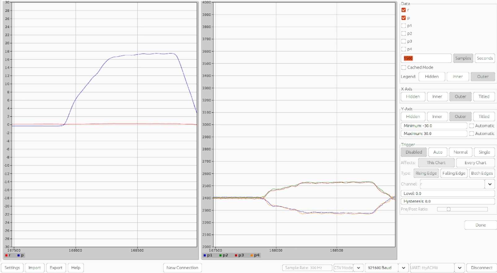

# QuadFS: Quadcopter From Scratch

## Overview

QuadFS is an open drone flight controller built from the ground up in embedded C on an STM32 microcontroller.

Every stage of the system is documented and explained so developers can understand how a complete flight controller works, from raw sensor data to stable flight.

<p align="center">
  
</p>

## Flight Control Pipeline

QuadFS implements the complete flight control pipeline:

- IMU communication over 400 kHz I²C
- Support for the MPU6050, MPU6500, and MPU9250
- Sensor calibration and filtering
- EKF based sensor fusion
- Roll, pitch, and yaw attitude estimation
- FlySky iBUS radio input using USART and DMA
- 2-DOF PID control running on a 3 ms control loop
- Motor mixing
- 400 Hz PWM output to the ESCs and motors
- Real time task management using FreeRTOS
- Telemetry, debugging, testing, and flight tuning

## Resources

The repository also contains supporting engineering resources used during development, including:

- Datasheets
- Schematics
- Research papers
- Calibration procedures
- Setup guides
- Debugging notes
- Test references

- [QuadFS Course on YouTube](https://www.youtube.com/playlist?list=PLBTVuKQ1XcVpDQbM3uqsKZsAigoQidbD6)
- [Course Details on Notion](https://bit.ly/4u76gaa)
- [Join the QuadFS Update List](https://forms.gle/EV1pthPxSTT2N7R58)
- [Follow Huobuilds on Instagram](https://www.instagram.com/huobuilds?igsh=YndnaHF2aGE1b211)


## YouTube Course

The firmware is accompanied by a step by step QuadFS course on YouTube.

The course explains how the system is designed, implemented, tested, tuned, and improved so that every part of the flight controller can be understood rather than simply copied.

## Building the Firmware

### Prerequisites

- [STM32CubeIDE](https://www.st.com/en/development-tools/stm32cubeide.html)
- [Git](https://git-scm.com)

### 1. Clone

```bash
# SSH
git clone git@github.com:huobuilds/quadfs_flight_controller.git

# HTTPS
git clone https://github.com/huobuilds/quadfs_flight_controller.git
```

You can optionally specify a folder name: `git clone <url> my-folder-name`

### 2. Import into STM32CubeIDE

1. **File → Import → General → Existing Projects into Workspace**
2. Browse to the cloned folder — the project will be detected automatically
3. Click **Finish**

### 3. Build

Press `Ctrl+B`. A successful build ends with `0 errors` — warnings are expected and can be ignored. Once built, the debug button becomes active.

### 4. Connect the ST-Link

Wire the ST-Link programmer to the Black Pill SWD header:

| ST-Link | Black Pill |
|---|---|
| SWDIO | DIO |
| SWDCLK | CLK |
| GND | GND |
| 3.3V | 3.3V |

> Power the board from the ST-Link 3.3V pin only if no other power source is connected. Do not connect 3.3V if the board is already powered via USB.

### 5. Flash

Click the **Debug** button (bug icon) in the toolbar, or go to **Run → Debug**. CubeIDE will flash the firmware and halt at the start of `main()`.

To run without stopping at the breakpoint, click **Resume** (F8) or use **Run → Run** instead of Debug.

---

## License

QuadFS firmware is licensed under the GNU General Public License v3.0
(or later) - see [LICENSE](LICENSE). You are free to use, study, modify,
and share it; anything you distribute that is built from it must remain
under the GPL with source available.

For commercial licensing without GPL obligations, contact
huobuilds@gmail.com.

Course videos, documents, and other non-code materials are (c) Henry
Odoemelem and licensed under CC BY-NC 4.0 unless stated otherwise.

Third-party components (CMSIS, STM32 device headers, CMSIS-DSP) retain
their own licenses (Apache-2.0) and their original headers.

## Safety

> ⚠️ **Always remove the propellers during bench testing and follow appropriate safety procedures.**


# QuadFS Troubleshooting Guide

Work through these checks **in order**.

Do not attempt flight until the sensor readings, motor behaviour, radio input, and control directions have been verified.

## Contents

1. [Roll and pitch are not close to zero on a level surface](#1-roll-and-pitch-are-not-close-to-zero-on-a-level-surface)
2. [Determine the IMU mounting offset correctly](#2-determine-the-imu-mounting-offset-correctly)
3. [Accelerometer calibration is incorrect](#3-accelerometer-calibration-is-incorrect)
4. [Gyro calibration is incorrect](#4-gyro-calibration-is-incorrect)
5. [Sensor axes are incorrectly mapped](#5-sensor-axes-are-incorrectly-mapped)
6. [The EKF does not settle](#6-the-ekf-does-not-settle)
7. [EKF angles drift or settle too slowly](#7-ekf-angles-drift-or-settle-too-slowly)
8. [The quadcopter leans during take-off](#8-the-quadcopter-leans-during-take-off)
9. [ESCs are not calibrated equally](#9-escs-are-not-calibrated-equally)
10. [Use the actual radio stick range](#10-use-the-actual-radio-stick-range)
11. [The drone yaws during hover](#11-the-drone-yaws-during-hover)
12. [Yaw works better in one direction than the other](#12-yaw-works-better-in-one-direction-than-the-other)
13. [I2C hangs or produces unstable IMU readings](#13-i2c-hangs-or-produces-unstable-imu-readings)
14. [The I2C address is incorrect](#14-the-i2c-address-is-incorrect)
15. [I2C calls block the flight-control loop](#15-i2c-calls-block-the-flight-control-loop)
16. [The wrong MCU is selected for the Black Pill](#16-the-wrong-mcu-is-selected-for-the-black-pill)
17. [The clock configuration is incorrect](#17-the-clock-configuration-is-incorrect)
18. [The EKF or PID uses the wrong time step](#18-the-ekf-or-pid-uses-the-wrong-time-step)
19. [FreeRTOS is not configured correctly](#19-freertos-is-not-configured-correctly)
20. [The floating-point unit is not enabled](#20-the-floating-point-unit-is-not-enabled)
21. [CMSIS-DSP or ARM math is missing](#21-cmsis-dsp-or-arm-math-is-missing)
22. [printf() does not print floating-point values](#22-printf-does-not-print-floating-point-values)
23. [The selected IMU requires different configuration](#23-the-selected-imu-requires-different-configuration)
24. [Final pre-flight check](#24-final-pre-flight-check)
---

## 1. Roll and pitch are not close to zero on a level surface

Place the quadcopter on a flat, stable surface and check the estimated attitude:

- Roll should be approximately 0°.
- Pitch should be approximately 0°.
- A good target is within ±0.5° to ±1°.

If roll or pitch is several degrees away from zero, check:

- Accelerometer calibration
- IMU axis mapping
- IMU mounting alignment
- Mechanical frame alignment
- Surface tilt

## 2. Determine the IMU mounting offset correctly

A table or floor may not be perfectly level. The measured angle therefore contains both the IMU mounting offset and the surface tilt:

```
Measured angle = IMU offset + surface tilt
```

To calculate the IMU offset:

1. Place the quadcopter on the surface.
2. Mark the positions of all four arms.
3. Read the roll or pitch angle and call it `A`.
4. Rotate the quadcopter by exactly 180°.
5. Align the four arms with the marked positions.
6. Read the same angle again and call it `B`.
7. Calculate:

```
IMU offset = (A + B) / 2
```

**Why it works:**

```
A = IMU offset + surface tilt
B = IMU offset - surface tilt
```

Adding both readings cancels the surface tilt:

```
A + B = 2 × IMU offset
```

## 3. Accelerometer calibration is incorrect

Calibrate the accelerometer properly before flight.

A badly calibrated accelerometer can make the flight controller believe that the drone is tilted even when it is level. This may cause the quadcopter to lean or drift immediately after take-off.

Repeat accelerometer calibration when:

- The IMU is replaced.
- The IMU mounting position changes.
- The board orientation changes.
- The calibration values appear incorrect.
- The temperature conditions change significantly.

## 4. Gyro calibration is incorrect

Calibrate the gyroscope **at every power-up**.

During gyro calibration:

- Place the quadcopter on a stable surface.
- Keep the quadcopter completely stationary.
- Do not touch or move the frame.
- Ensure that the motors are not running.
- Allow the offset calculation to finish before moving the drone.
- The calibration is complete when the status LED starts blinking.

An incorrect gyro offset can cause:

- Roll or pitch drift
- Continuous yaw rotation
- Poor EKF settling
- Unstable PID corrections

## 5. Sensor axes are incorrectly mapped

If the EKF does not settle or the angles move in the wrong direction, check the sensor-axis mapping.

Confirm that:

- Accelerometer, gyroscope, and magnetometer readings use the same body coordinate frame.
- No axis has been swapped incorrectly.
- No axis sign has been inverted incorrectly.
- Roll movement produces a roll-angle change.
- Pitch movement produces a pitch-angle change.
- Clockwise and counterclockwise yaw produce the expected gyro-Z signs.

Move the drone manually around **one axis at a time** and observe the corresponding sensor and estimated-angle values.

## 6. The EKF does not settle

If the EKF does not settle, first check:

- Sensor-axis mapping
- Sensor signs
- Accelerometer calibration
- Gyro calibration
- EKF time step, `dt`
- Sensor scale factors
- Sensor units
- Initial covariance values
- Process and measurement noise values

**Do not begin by changing the EKF tuning values randomly.**

Incorrect sensor direction, units, or timing cannot be fixed by tuning the covariance matrices.

## 7. EKF angles drift or settle too slowly

When the drone is stationary:

- Roll and pitch should not drift continuously.
- The angles should return to their resting values after movement.
- The values should settle within a reasonable time.
- Large oscillations or slow movement toward zero indicate a problem.

Check:

- Gyro bias
- Accelerometer calibration
- EKF `dt`
- Process-noise values
- Measurement-noise values
- Sensor filtering
- Vibration from the frame or motors

Compare your output with the course video example:

> Video link: [](https://youtu.be/zXPQdfvipLQ)

## 8. The quadcopter leans during take-off

If the quadcopter consistently leans toward one side, check the following **before changing the PID gains**:

1. Roll and pitch readings are close to zero on a level surface.
2. Motor numbering matches the mixer configuration.
3. Motor rotation directions are correct.
4. Propellers are installed in the correct positions.
5. ESCs are calibrated together.
6. All motors start at approximately the same throttle value.
7. No motor or propeller is damaged.
8. The frame is balanced.
9. The PID correction direction is correct.

If one motor starts noticeably later than the others, investigate:

- Incorrect ESC calibration
- Excessive motor friction
- Damaged motor bearings
- A faulty ESC
- Poor wiring or solder joints
- Incorrect minimum motor command

Do not immediately assume that the motor is faulty.

Swap the motor or ESC position to determine whether the problem **follows the motor or the ESC**.

## 9. ESCs are not calibrated equally

Calibrate **all ESCs at the same time** using the same minimum and maximum throttle values.

Unequal ESC calibration can cause:

- One motor to start later than the others
- Unequal thrust at the same command
- Leaning during take-off
- Poor yaw control
- Increased PID correction

After calibration, slowly increase the throttle **without propellers** and confirm that all four motors start at approximately the same command.

## 10. Use the actual radio stick range

Do not assume that every radio receiver outputs exactly 1000 to 2000.

Measure the actual values received from each channel:

- Minimum stick value
- Centre stick value
- Maximum stick value

Example:

```
Minimum: 988
Centre:  1497
Maximum: 2012
```

Use the **measured** values when normalising the radio input.

Also add:

- Deadband around the centre position
- Input-range validation
- Failsafe detection
- Lost-signal handling

Using the wrong expected range can produce incorrect setpoints and prevent the drone from reaching the intended maximum command.

## 11. The drone yaws during hover

If the drone rotates during hover without a yaw command, check:

- Gyro-Z offset
- Gyro-Z sign
- Yaw correction sign
- Motor rotation directions
- Propeller directions
- ESC calibration
- Motor thrust imbalance
- Frame twisting
- Yaw integral gain
- Yaw mixer configuration
- Radio yaw-stick centre value
- Radio deadband

When the drone is stationary, the calibrated gyro-Z reading should remain close to zero.

Also confirm that a positive yaw correction increases the correct motor pair and decreases the opposite motor pair.

## 12. Yaw works better in one direction than the other

If the quadcopter responds properly to yaw commands in one direction but weakly in the opposite direction, check:

- Yaw moment limit
- Yaw mixer signs
- Motor rotation directions
- Motor-command saturation
- Minimum motor-command limit
- Maximum motor-command limit
- ESC calibration
- Motor thrust differences

The yaw correction may be getting clipped by the configured moment limit.

Increase the yaw moment limit **gradually** while monitoring motor saturation.

Do not increase the limit blindly. Make sure that sufficient motor authority remains for roll, pitch, and altitude control.

## 13. I2C hangs or produces unstable IMU readings

Check the SDA and SCL pull-up resistors.

For Fast Mode I2C at 400 kHz, weak pull-ups may produce slow signal rise times and unreliable communication.

If the IMU board already contains 10 kΩ pull-ups, external pull-ups can be added in parallel to 3.3 V. Common values include:

- 4.7 kΩ
- 3.3 kΩ

The correct value depends on:

- Bus capacitance
- Wire length
- Number of connected devices
- Existing pull-up resistors
- Supply voltage

Also check:

- Common ground
- Correct I2C pins
- Short wiring
- Stable 3.3 V supply
- Correct alternate-function configuration
- Correct I2C timing
- Sensor acknowledgement

## 14. The I2C address is incorrect

Confirm the IMU address.

STM32 HAL expects the 7-bit address shifted one bit to the left:

```c
#define MPU_ADDR (0x68U << 1)
```

If the IMU `AD0` pin is high, the address is normally:

```c
#define MPU_ADDR (0x69U << 1)
```

Do not mix an already shifted 8-bit address with another left shift.

## 15. I2C calls block the flight-control loop

Avoid long blocking timeouts inside the flight-control loop.

Example:

```c
#define IMU_I2C_TIMEOUT_MS 1U
```

Do not use `HAL_MAX_DELAY` for normal IMU reads inside the control loop.

If an IMU transaction fails:

- Record the error.
- Skip or safely handle the invalid sample.
- Attempt communication recovery.
- Do not allow the entire control task to remain blocked.

## 16. The wrong MCU is selected for the Black Pill

Confirm the actual microcontroller using **STM32CubeProgrammer**.

Some Black Pill boards may be labelled as STM32F401, while the detected device may actually be an STM32F411 or another compatible-looking device.

Configure the project for the actual detected chip, including:

- STM32CubeIDE target
- Startup file
- Linker script
- CMSIS device definition
- Preprocessor symbols
- Flash size
- RAM size
- Clock configuration

Using the wrong MCU configuration can cause build problems, incorrect peripheral settings, or unexpected runtime behaviour.

## 17. The clock configuration is incorrect

Verify:

- System clock
- AHB clock
- APB1 clock
- APB2 clock
- Timer input clocks
- I2C clock
- FreeRTOS tick
- PWM frequency
- UART baud rates

Incorrect clocks can affect:

- ESC PWM frequency
- Motor pulse width
- I2C timing
- Radio communication
- Telemetry communication
- FreeRTOS delays
- EKF `dt`
- PID execution rate

Remember that STM32 timer clocks may run at **twice the APB clock** when the APB prescaler is greater than one.

## 18. The EKF or PID uses the wrong time step

The EKF and PID controller must use the correct execution period.

For a fixed-rate loop, use a stable periodic task such as:

```c
vTaskDelayUntil();
```

Do not assume that a requested delay always produces the exact desired loop period.

**Measure the actual execution interval** and verify that it matches the configured `dt`.

An incorrect `dt` affects:

- Gyro integration
- EKF prediction
- Derivative control
- Integral accumulation
- Filter behaviour

## 19. FreeRTOS is not configured correctly

If the project uses tasks, confirm that FreeRTOS has been added and configured correctly.

Check:

- Task priorities
- Task stack sizes
- Heap size
- Tick frequency
- Control-loop period
- Shared-data protection
- Interrupt priorities
- Blocking calls

Use `vTaskDelayUntil()` for fixed-rate tasks instead of repeatedly calling `vTaskDelay()`.

The control task should not be delayed by long telemetry transmissions, logging, or blocking sensor calls.

## 20. The floating-point unit is not enabled

For an STM32F411 using hardware floating point, configure the Cortex-M4F FPU correctly.

Typical compiler options are:

```
-mfpu=fpv4-sp-d16
-mfloat-abi=hard
```

Ensure that all linked libraries use a compatible floating-point ABI.

For FreeRTOS configurations that provide the option, verify the required FPU support setting, such as:

```c
#define configENABLE_FPU 1
```

The exact FreeRTOS configuration depends on the port and version used.

## 21. CMSIS-DSP or ARM math is missing

If the project uses CMSIS-DSP functions:

- Add the CMSIS-DSP include path.
- Include `arm_math.h`.
- Compile or link the correct CMSIS-DSP sources or library.
- Select the correct Cortex-M4 configuration.
- Ensure that the library matches the floating-point ABI.

A typical processor definition may include:

```c
#define ARM_MATH_CM4
```

Do not link a Cortex-M7 or soft-float library into a Cortex-M4F hard-float project.

## 22. printf() does not print floating-point values

If floating-point values do not appear correctly with `printf()`, enable float formatting support.

For the GNU linker, add:

```
-u _printf_float
```

Remember that floating-point `printf()` increases flash usage and may be slow.

Avoid excessive logging inside the flight-control loop.

## 23. The selected IMU requires different configuration

QuadFS can be adapted for devices such as:

- MPU6050
- MPU6500
- MPU9250

However, do not assume that every IMU board uses the same:

- Scale factor
- Axis orientation
- Calibration offsets
- Noise characteristics

Each sensor and breakout board must be configured and calibrated independently.

---

## 24. Final pre-flight check

Before installing the propellers, confirm that:

- [ ] Roll and pitch are close to zero on a level surface.
- [ ] Gyro readings remain close to zero when stationary.
- [ ] Roll, pitch, and yaw signs are correct.
- [ ] The EKF settles properly.
- [ ] Radio channels move in the correct directions.
- [ ] Actual radio minimum, centre, and maximum values are configured.
- [ ] Motor numbering matches the mixer.
- [ ] Motor rotation directions are correct.
- [ ] ESCs are calibrated equally.
- [ ] All motors start at approximately the same command.
- [ ] PID corrections drive the motors in the correct direction.
- [ ] The motor-stop and failsafe functions work.
- [ ] The control-loop period is stable.
- [ ] No I2C or communication error blocks the control task.

Perform the first tests **without propellers**.

Only install the propellers after all sensor, radio, motor, mixer, and failsafe checks have passed.